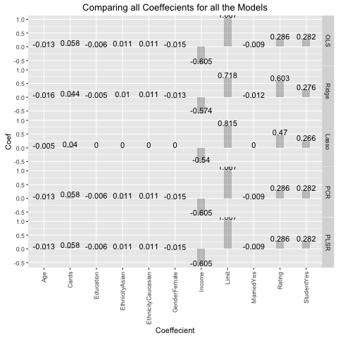

## Introduction 

Statistical Analysis project with the goal of comparing multiple linear models for the Balance variable in credit data.

We will examing the following models to try and apply to future credit card data to estimate balance numbers.

1. Ordinary Least Squared
2. Lasso 
3. Ridge
4. Principal Component Regression
5. Partial Least Squared Regression


## Data

We have a data set containing variables that relate to credit. 

**4 Qualitative Variables**
1. Gender
2. Student
3. Married Ethnicity 

**7 Quantitative Variables**
1. Income
2. Limit
3. Rating
4. Cards
5. Age
6. Education
7. Balance

We trained ou models with a set of 300 points and tested on 100 points taken randomly from the original Credit.csv data

## Examining the Credits data


## Correlation | Matrix

```{r, echo=FALSE, include=FALSE}
load(file = "../data/correlation_matrix.RData")
```

```{r, echo=FALSE}
print(cor_matrix, type = "html")
```

## Comparing Errors for PCR and PLSR

<div class="columns-2">

PCR CV Errors


<div>

...

</div>

PLSR CV ERrors


</div>


## Coefficients of the Models | Our predictors 

```{r, echo = FALSE, include = FALSE}
load('../data/MSE_ols.RData')
load('../data/MSE_ridge.RData')
load('../data/MSE_pcr.RData')
load('../data/mse_lasso.RData')
load('../data/mse_plsr.RData')
load('../data/ols_model.RData')
load('../data/ridge_model.RData')
load('../data/lasso_model.RData')
load('../data/pcr_model.RData')
load('../data/plsr_model.RData')

library(xtable)
library(Matrix)
options(xtable.caption.placement = 'top', xtable.comment = FALSE)
```

```{r, echo=FALSE, xtable, results='asis', include = FALSE}
Variables <- c("Intercept", "Income","Limit", "Rating", "Cards", "Age", "Education", "GenderFemale", "StudentYes", "MarriedYes", "EthnicityAsian", "EthnicityCaucasian")
OLS <- as.vector(ols_coef)
Ridge <- as.vector(best_model_ridge)
Lasso <- as.vector(bestmodel_lasso)
PCR <- as.vector(pcr_coef)
PCR <- append(PCR, 0, 0)
PLSR <- as.vector(plsr_coef)
PLSR <- append(PLSR, 0, 0)

Coef.frame <- data.frame(Variables, OLS, Ridge, Lasso, PCR, PLSR)

Coef_table <- xtable(Coef.frame, caption="Compare - Coefficients", digits = 3)
print(Coef_table, type="latex")

```

```{r, echo=FALSE, results='asis'}
print(Coef_table, type="html")
```

## Model MSE 

```{r, echo=FALSE, results='asis'}
MSE <- c(MSE_ols, MSE_ridge, lasso_mse, MSE_pcr, plsr_mse)
Model <- c('OLS', 'Ridge', 'Lasso', 'PCR', 'PLSR')
mse.frame <- data.frame(Model, MSE)

MSE_table <- xtable(mse.frame, caption="Compare - MSE", digits = 3)
print(MSE_table, type="html")
```

## Comparing Coeffecients 


**The best predictor based on having the least error is Ridge**

